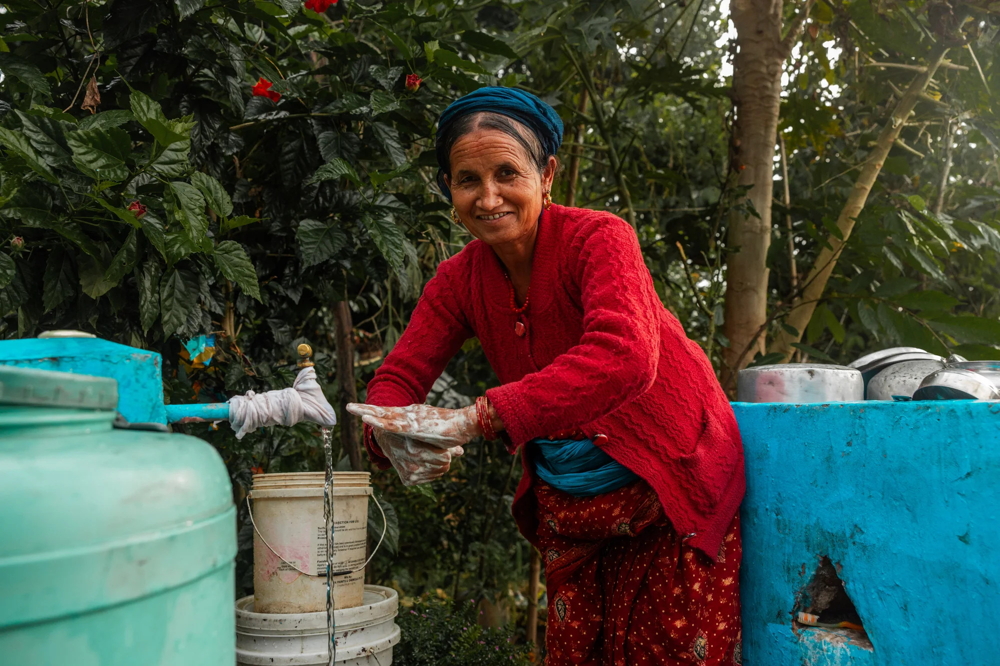

<html lang="en">

<head>
  <meta charset="UTF-8">
  <meta name="viewport" content="width=device-width, initial-scale=1.0">
  <title>Chaity: Water</title>
  <link href="https://cthomas9524.github.io/charity.water" rel="stylesheet">
  
</head>

<body>
  

    

      
    
 
    

      
    

    

      <h1>Charity: Water</h1>
      
Change isn’t a Donation. It’s a Movement

      

        When clean water flows into a village, girls go back to school. 
        When education programs are funded, whole families rise. 
        When voices are heard, systems shift.  
        This isn’t just about helping. It’s about rebuilding futures with those who’ve been left out of the story.  
        So, how do you get connected..?
      

      

        <button>Get Involved</button>
        <button>Donate</button>
        <button>About Us</button>
      

    

  

</body>

</html>

</html>
